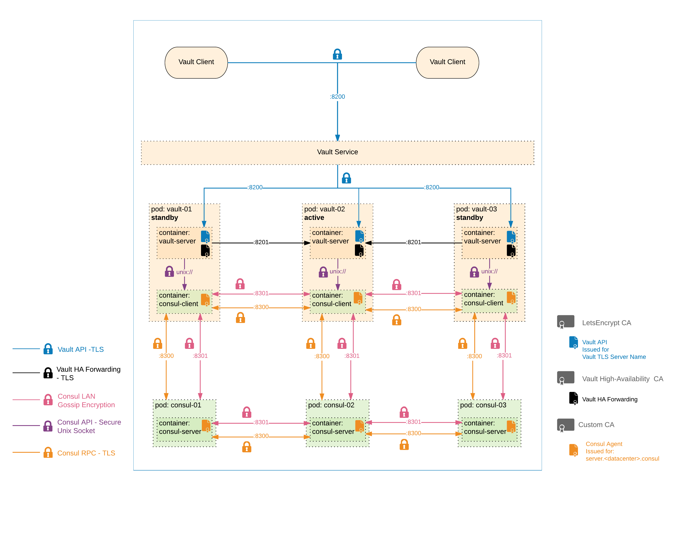

  # Vault

> **Breaking Changes**: New releases may contain breaking changes to this chart as it evolves. Please read the [CHANGELOG](CHANGELOG.md) prior to upgrading.

This project sets up [Vault by Hashicorp](https://www.vaultproject.io/) on Kubernetes using Helm in a HA configuration.  It create its own private Consul backend and secures the Consul and Vault traffic. Also, optionally, a Consul UI and Vault UI can be enabled.

It isn't hard to [get started](https://www.vaultproject.io/intro/getting-started/install.html) with Vault. There is also [charts](https://github.com/kubernetes/charts/tree/master/stable/consul) that will get Consul running in K8S. AWS has a solution if you want to use [CloudFormation templates](https://aws.amazon.com/quickstart/architecture/vault/). Putting this all together yourself in a secure way turns out to be much harder. This projects takes on a lot of the tasks that would normally be manual. From unsealing Vault to TLS creation for client and backend communication. Also automatically backing up the Consul data to AWS S3. The default setup will create 5 Consul replicas and 3 Vault replicas.

##### Tech stack
[Vault](https://www.vaultproject.io/), [Consul](https://www.consul.io/), [K8S](https://kubernetes.io/), [Helm](https://github.com/kubernetes/helm), [AWS S3](https://aws.amazon.com/s3/), Bash, OpenSSL, [kubectl](https://kubernetes.io/docs/tasks/tools/install-kubectl/), [Let's Encrypt](https://letsencrypt.org/docs/)

### Contents
<!-- TOC depthFrom:2 depthTo:2 withLinks:1 updateOnSave:1 orderedList:0 -->

- [Installing Vault](#installing-vault)
- [Upgrading Vault](#upgrading-vault)
- [Testing Vault](#testing-vault)
- [Concepts (Work in progress)](#concepts-work-in-progress)
- [Security](#security)
- [Backup and recovery](#backup-and-recovery)
- [Deleting Vault](#deleting-vault)
- [Future Work](#future-work)

<!-- /TOC -->

## Installing Vault

### Prerequisites
* Kubernetes 1.5.x
* Helm 2.5.x
* LetsEncrypt Account and Route53 access (optional)
* Amazon S3 access (optiona, for backups)

### Configuration

| Parameter               | Description                           | Default                                                    |
| ----------------------- | ----------------------------------    | ---------------------------------------------------------- |
| `rbac.create` | Create RBAC service accounts, roles and rolebindings for components | `true` |
| `Consul.ComponentName` | Used for resource names and labeling | `consul` |
| `Consul.Cpu` | Consul container requested cpu | `100m` |
| `Consul.Datacenter` | Consul datacenter name | `dc1` |
| `Consul.Image` | Consul container image name | `consul` |
| `Consul.ImageTag` | Consul container image tag | `0.9.2` |
| `Consul.ImagePullPolicy` | Consul container pull policy | `IfNotPresent` |
| `Consul.Memory` | Consul container requested memory | `256Mi` |
| `Consul.Replicas` | Consul container replicas | `5` |
| `Consul.maxUnavailable` | Consul container PodDisruptionBudget maxUnavailable instances | `2` |
| `Consul.updatePartition` | Consul container updatePartition number for Phased Roll Outs | `0` |
| `Consul.HttpPort` | Consul http listening port | `8500` |
| `Consul.SerflanPort` | Consul serf lan listening port | `8301` |
| `Consul.SerflanUdpPort` | Consul serf lan UDP listening port | `8301` |
| `Consul.SerfwanPort` | Consul serf wan listening port | `8302` |
| `Consul.SerfwanUdpPort` | Consul serf wan UDP listening port | `8302` |
| `Consul.ServerPort` | Consul server listening port | `8300` |
| `Consul.ConsulDnsPort` | Consul DNS listening port | `8600` |
| `Consul.PodManagementPolicy` | Consul statefulset pod management policy | `` |
| `Consul.PreInstall.ComponentName` | Used for resource names and labeling  | `consul-preinstall` |
| `Consul.PreInstall.JobDeadline` | Timeout for Consul pre-install job (seconds) | `30` |
| `Consul.PreInstall.Tls.CountryName` | TLS cert country name | `US` |
| `Consul.PreInstall.Tls.LocalityName` | TLS cert locality name | `placeholder` |
| `Consul.PreInstall.Tls.EmailAddress` | TLS cert email address | `placeholder@placeholder.com` |
| `Consul.PreInstall.Tls.OrganizationName` | TLS cert organization name | `placeholder` |
| `Consul.PreInstall.Tls.StateOrProvinceName` | TLS cert state | `CO` |
| `Consul.PreInstall.Tls.OrganizationUnitName` | TLS cert organization unit name | `placeholder` |
| `Consul.Backup.Enabled` | Consul backups enabled | `false` |
| `Consul.Backup.ComponentName` | Used for resource names and labeling | `backup` |
| `Consul.Backup.Replicas` | Consul backup container replicas | `1` |
| `Consul.Backup.ImagePullPolicy` | Consul backup container pull policy | `Always` |
| `Consul.Backup.Image` | Consul backup container image name | `thorix/consul-backup` |
| `Consul.Backup.ImageTag` | Consul backup container image tag | `latest` |
| `Consul.Backup.Cpu` | Consul backup requested cpu | `512m` |
| `Consul.Backup.Memory` | Consul backup container requested memory | `200Mi` |
| `Consul.Backup.S3URL` | Consul backups S3 bucket path, e.g `s3://my-bucket` (helm `.Release.Name` will get added to the end) |  |
| `Consul.Backup.SleepDuration` | Backup interval (in seconds) | `7200` |
| `Consul.Restore.ComponentName` | Used for resource names and labeling | `restore` |
| `Consul.Restore.S3URL` | Full restore S3 bucket path, e.g. `s3://my-bucket/vault-a/` |  |
| `Consul.Restore.RestoreFile` | Filename in s3 to restore from, this field triggers the restore option |  |
| `Consul.Restore.AwsAccessKeyId` | AWS key with access to the restore s3 location |  |
| `Consul.Restore.AwsSecretAccessKey` | AWS secret key with access to the restore s3 location | |
| `Vault.ComponentName` | Used for resource names and labeling | `vault` |
| `Vault.AutoUnseal` | Vault auto-unsealing (deprecated) | `false` |
| `Vault.HttpPort` | Vault http listening port | `8200` |
| `Vault.HaForwardingPort` | Vault high-availability port-forwarding port | `8201` |
| `Vault.Ingress.Enabled` | Enable ingress. If enabled, will use service type ClusterIP | `true` |
| `Vault.NodePort` | Vault service NodePort to open. Ignored if Ingress.Enabled = true  | `30825` |
| `Vault.Image` | Vault container image name | `vault` |
| `Vault.ImageTag` | Vault container image tag | `0.9.0` |
| `Vault.ImagePullPolicy` | Vault container pull policy | `IfNotPresent`
| `Vault.LogLevel` | Set vault log level (trace, debug, info, etc.) | `info` |
| `Vault.Replicas` | Vault container replicas | `3` |
| `Vault.maxUnavailable` | Vault container PodDisruptionBudget maxUnavailable instances | `1` |
| `Vault.Readiness.readyIfStandby` | Mark Vault pods as ready to start accepting traffic when `Standby` status is reached | `true` |
| `Vault.Readiness.readyIfSealed` | Mark Vault pods as ready to start accepting traffic when `Sealed` status is reached | `false` |
| `Vault.Readiness.readyIfUninitialized` | Mark Vault pods as ready to start accepting traffic when `Uninitialized` status is reached | `true` |
| `Vault.Cpu` | Vault container requested cpu | `512m` |
| `Vault.Memory` | Vault container requested memory | `200Mi` |
| `Vault.HostAliases` | List of hostfile entries, see [docs](https://kubernetes.io/docs/concepts/services-networking/add-entries-to-pod-etc-hosts-with-host-aliases/) for details and format |  |
| `Vault.DisableConsulRegistration` | [Disable Vault registration within Consul ](https://www.vaultproject.io/docs/configuration/storage/consul.html#disable_registration) | `false` |
| `Vault.DefaultLeaseTtl` | Default lease TTL for Vault tokens | `768h` |
| `Vault.MaxLeaseTtl` | Max lease TTL for Vault tokens | `768h` |
| `Value.config.tcpAdditionalOptions` | Additional options to be added to the Vault TCP configuration | `` |
| `Vault.ConsulClient.ComponentName` | Used for resource names and labeling | `consul-client` |
| `Vault.PreInstall.ComponentName` | Used for resource names and labeling | `vault-preinstall` |
| `Vault.PreInstall.JobDeadline` | Timeout for Vault pre-install job(s) (seconds)  | `100`
| `Vault.Tls.ServerName` | Vault TLS/ingress hostname | `vault.consul` |
| `Vault.Tls.AlternateServerNames` | Vault TLS/ingress alternative hostnames (comma separated) | `vault-alt.consul` |
| `Vault.Tls.CertString` | Provide a TLS certificate file to use in Vault's listener |  |
| `Vault.Tls.KeyString` | Provide a TLS certificate key file to use in Vault's listener |  |
| `Vault.Tls.CertManager.Enabled` | Enable cert-manager certs | `false` |
| `Vault.Tls.CertManager.CertificateSpec` | Specification of the cert-manager certificate resource | `` |
| `Vault.Tls.CertManager.certReloader.name` | Name given to the cert-manager reload resources | `cert-reloader` |
| `Vault.Ui.Enabled` | Enable Vault UI | `false` |

Additional dependencies

| Parameter               | Description                           | Default                                                    |
| ----------------------- | ----------------------------------    | ---------------------------------------------------------- |
| `Misc.kubectl.Image` | Consul Preinstall Job container image name | `bartlettc/docker-kubectl` |
| `Misc.kubectl.ImageTag` | Consul Preinstall Job container image tag | `latest` |
| `Misc.omgwtfssl.Image` | Vault Preinstall Job container image name | `bartlettc/omgwtfssl-kubernetes` |
| `Misc.omgwtfssl.ImageTag` | Vault Preinstall Job container image tag | `latest` |
| `Misc.letsencrypt.Image` | Let's encrypt container image name | `bartlettc/letsencrypt-acm` |
| `Misc.letsencrypt.ImageTag` | Let's encrypt container image tag | `kubernetes` |

### Helm Install

Checkout the repo:
```bash
git clone https://github.com/ReadyTalk/vault-helm-chart.git
cd vault-helm-chart
```

To install the chart with the release name `vault` in namespace `vault` with the default configuration (see above for values definitions):

```bash
helm install --name vault --namespace vault helm_charts/vault
```

> Note:  By default, this chart will install with a self-signed certificate and therefore will require you to pass in the `-tls-skip-verify` to your vault commands.  To pass in your own valid certificate, use the `Vault.Tls` options (see above).

It will take a minute or two for the pre-installation steps to run. Then Helm will finish installing all the necessary resources.

To check the status run `kubectl get po -l release=vault-prod,component=vault -n vault` and all pods should have a `Running` status.

> **Notes on pre-install steps**: This Helm chart has pre-install jobs that create certain Kubernetes secrets before the rest of the application get set up.  See the READMEs in [helm_charts/vault/init/preInstallConsul](helm_charts/vault/preInstallConsul) and [helm_charts/vault/init/preInstallVault](helm_charts/vault/preInstallVault) for more information on what is going on here.  If there is a failure while running the install, it could be due to the pre-install scripts failing. To look at the pre-install resources:
```
kubectl get po,jobs,cm,secrets -l 'component in (consul-preinstall,vault-preinstall),release=vault-prod' -n vault --show-all
```

### Initialize Vault
If this is a new instance of Vault, it needs to be initialized.  To do this, run

```
./init/vault-init.sh vault-prod vault
```

This script does 3 things:
* Initializes Vault
* Displays the Vault Unseal Keys and Root Token
* Saves the Vault Unseal Keys as a Kubernetes secret

> **IMPORTANT**: You must save off the Unseal Keys and Root Token as this is the only time they will be shown.  The Unseal Keys are needed unseal vault in the case of failure and the Root Token is needed to auth with Vault for admin tasks.

### Unseal Vault

If this is a new instance of Vault, it will need to be unsealed manually.  Any pod restarts in the future will auto-unseal.

To manually unseal the vault, run

```
./init/vault-unseal.sh vault-prod vault
```

## Upgrading Vault
To upgrade vault with new configuration values, run

```
helm upgrade --values=helm_charts/vault/values-prod.yaml vault-prod helm_charts/vault/
```

> **Note when upgrading**
Certain components cannot be upgraded simply with a `helm upgrade`, primarily, anything that was created with the helm pre-installation process. This includes
* Consul TLS certificates
* Consul Gossip Keys
* LetsEncrypt TLS certificates

>Also if the Consul stateful set it being modified, it must be updated with a rolling restart *-process TBD--*.

## Renewing Vault Certificate (TLS Secret)

* Step 1: Connect to the correct kubernetes cluster
* Step 2: Generate new certificate using appropriate tool
* Step 3: Combine new certificate and intermediate certificate, in that order, into bundle file
* Step 4: Update kubernetes tls secret

```bash
# one liner to update kubernetes tls secret (cert and key):
kubectl create secret tls \
  --cert="/path/to/combined/cert.bundle" \
  --key="/path/to/private.key" \
  <name of secret>.tls --dry-run -o yaml | kubectl apply -f -
# deploy by destroying one vault pod at a time
kubectl delete po/<name of pod>
# monitor for changes to certificate date as pods recreate
watch -n1 "echo | openssl s_client -connect vault.example.com:8200 2>/dev/null | openssl x509 -noout -dates"
```


## Testing Vault

Installation Variations
* CA Variation
** Self-signed CA
** LetsEncrypt Stage CA
* UI test

Upgrade Variations
* Upgraded from last minor release

Tests
* Consul Members
* Vault Read
* Vault Write
* Auto Unseal
* Backup and Restore


## Concepts (Work in progress)
* Multiple Vaults in 1 namespace
* Letsencrypt
* Ingress Controller
* Auto Unsealing
* Readiness

## Security

With this setup, all network communication is encrypted with TLS.  See the figure below for details.


## Backup and recovery

This Helm chart has a built-in backup/restore option which can be used to take snapshots of the Vault's encrypted backend data (from Consul) and restore it in the case of a full Consul failure.

### Backing up Vault

Backups can be enabled and configured with the `Consul.Backup.*` option values. Backups work by taking a periodic [snapshot of Consul](https://www.consul.io/docs/commands/snapshot.html) and shipping those snapshots to an S3 bucket.

> **Note**: At this time AWS S3 access for backups is a assumed with AWS Roles given to the K8S cluster nodes. Future work might be done to pull from vault the needed access for it's own backups.

### Restoring from Backup

> **Warning**: The restore process will create an exact restore of your Vault instance at the point of the snapshot.  This means that any leases that have expired since the backup was taken will be immediately revoked. It will have no knowledge of lease renewals that happened after the snapshot and therefore could unexpectedly revoke external leases (AWS, MySQL, etc).  Take extreme caution when performing a restore from a production backup!

> **Note**: When doing a restore, ensure that the Consul and Vault versions are compatible with version used to create the snapshot file.

A restore can be configured with the `Consul.Restore.*` option values.  The restore process uses a Kubernetes job to perform a [`consul snapshot restore`](https://www.consul.io/docs/commands/snapshot/restore.html) based on a provided snapshot file stored in AWS S3. A set of AWS credentials are required to be passed in to permform this action. With all the restore variables set `helm install` will pull down the snapshot and apply that to the cluster. The following is an example of how you could install vault using a backup file:

> **Important Notes**: The restore process will only work on a fresh install of the helm chart.  Doing a `helm upgrade` will not envoke the restore option(s). This is a design feature to prevent restoring on top of a working Consul cluster.

For the restore option, specific AWS credentials with access to s3 must be provided.

```bash
helm install \
  --values=values-prod.yaml \
  --namespace=vault \
  --name=vault-prod \
  --set Consul.Restore.S3URL=s3://vault-backups/prod/ \
  --set Consul.Restore.RestoreFile=consul-20180101.171653.snap \
  --set Consul.Restore.AwsAccessKeyId=xxxxxxxxxx \
  --set Consul.Restore.AwsSecretAccessKey=xxxxxxxxxx \
  vault
```

## Deleting Vault

To delete the chart:
```bash
helm delete vault-prod --purge
```

Also, due to the way helm does pre-installs and the way the vault/consul secrets are generated, you'll need to clean up these extra resources by running the following command:
```bash
kubectl delete po,jobs,cm,secrets -l 'component in (consul-preinstall,vault-preinstall,unseal-keys),release=vault-prod' -n vault
```

Lastly, the ingress controller creates a configmap that needs to be cleaned up as well.
```
kubectl delete cm ingress-controller-leader-nginx -n vault
```
## Troubleshooting

### Querying Consul

```
consul members -client-cert /consul/tls/tls.crt -client-key /consul/tls/tls.key -ca-file /consul/ca/ca.crt.pem -http-addr https://localhost:8500 -tls-server-name server.<datacenter>.consul
```

## Future Work

### Cleanup
* Add Helm default vaules
* Document Helm values

### Security
* Secure Consul UI
** Access to the consul ui should be restricted via some kind of auth or, at a minimum, set to read-only

### High Availability
* Updating LetsEncrypt Certs
* Updating Consul certs via custom CA
** The Consul server/client certs, as well as the CA, will need to be rotated out periodically.  Need to figure out how to do this automatically with no downtime
* Add node affinity
** Ensure that consul and vault pods are spaced out amongst all the kubernetes nodes to ensure failure in one AZ doesn't disrupt service
